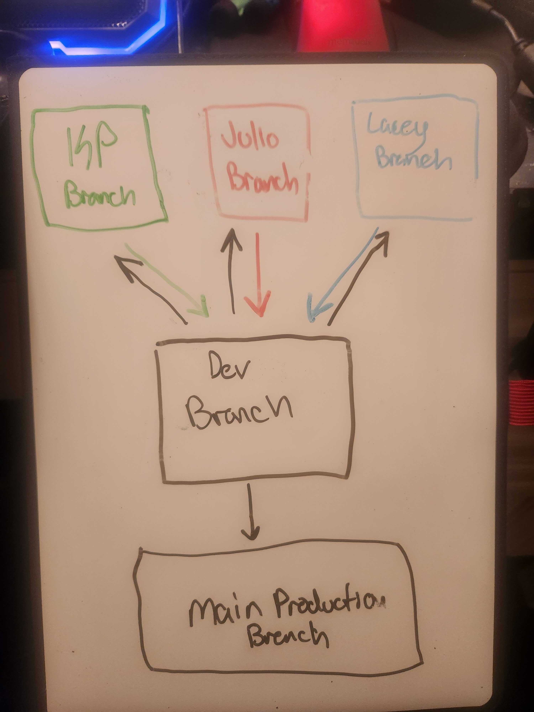

# Motiv8

Team Members: Julio Ramirez, Lacey Washington, and KP Gomez.

## Cooperation Plan
Every person on your team is an asset. This is your chance to discover the hidden strengths and areas for growth for each team member.

Describe at least:

1. What are the key strengths of each person on the team? 

Julio is skilled in logical-thinking as well as building out the back-end servers. Lacey is highly creative and his strengths include both the front-end and back-end. KP is really good at finding resources for the project and completing administrative stuff. She is more comfortable with the back-end servers.

2. How can you best utilize these strengths in the execution of your project? Julio will use his forte in logical thinking to figure out what's working and what's not working. Lacey will use his strengths to innovate and come up with new and creative solutions. KP will use her strengths to

3. In which professional competencies do you each want to develop greater strength? Lacey would like to improve on his time and project management skills. KP would like to improve on her communication skills and learning how to express her ideas more articulately. Julio would like to work on his communication and leadership skills.

4. Knowing that every person in your team needs to understand all aspects of the project, how do you plan to approach the day-to-day work? We will start with a check-in at the beginning of our meet to talk about what everyone accomplished the day before, communicate blockers, air out any grievances, and this will also be the opportunity to ask questions. We will also implement a code review through Invisio or any other whiteboard tool to first spell out the steps/pseudo-code needed before writing the actual code itself. During the whiteboard process, we will be updating our project board in GitHub for defining tasks and assigning them to each member of the team member based on comfortability.

**NOTE: Undoing, Redoing, Replacing, or otherwise steamrolling the project as an individual is considered to be unacceptable. Account for the inevitable divergence of ideas, execution tasks, and assignments of duties here.**

## Conflict Plan

Your team should agree on a process for handing disagreements, should they arise. It is better to have a plan in place ahead of time so you can all refer back to it when necessary.

Describe at least:

1. What will be your group’s process to resolve conflict, when it arises? We will maintain open communication and implement psychological safety. Everyone should be comfortable expressing differing ideas and opinions, while being respectful of each other's ideas and to not take any feedback or criticism personal. If there is an issue, we need to make sure to not let it linger, and ensure it is brought before the group immediately. We will then talk it over as a group. 

2. What will your team do if one person is taking over the project and not letting the other members contribute? Take a step back, open lines of communication, and try to negotiate or come to a compromise. We can then unpack and figure out why they are not asking for help, and/or why they aren't allowing others to contribute. 

3. How will you approach each other and the challenges of the project knowing that it is impossible for all members to be at the exact same place in understanding and skill level? We are a team and it is important to show grace to one another. We will play on our own individual strengths and maybe learn from one another on items we're not as strong in. 

4. How will you raise concerns to members who are not adequately contributing? Immediately let the team member know right away as a group.

5. How and when will you escalate the conflict if your resolution attempts are unsuccessful? Sit down with the instructor if previous attempts did not work. There will be a two strikes rule.

## Communication Plan
Before beginning to tackle the project, determine how your group will communicate with each other. This is not an individual effort. Make sure everyone feels comfortable with the identified methods of speaking up.

Describe at least:

1. What hours will you be available to communicate? Class hours and not after midnight. Lacey will be available during normal class hours and Monday/Tuesday at any time. Fridays are off-limits. KP will be available during normal class hours and as well as after hours but no later than midnight. Julio will be available during normal class hours and if needed until midnight. 

2. What platforms will you use to communicate (ie. Slack, phone …)? Slack and phone. 

3. How often will you take breaks? 15 minute break after every 45 minutes of work, and lunch is schedule for 11am PST which is 1pm CST on Saturdays.

4. What is your plan if you start to fall behind? As an individual ask for help, and as a group we can come together and help each other catch up. Timebox each task. 

5. How will you communicate after hours and on the weekend? Cell phone, if needed. Midnight is the cut-off. 

6. What is your strategy for ensuring everyone’s voice is heard? Our daily check-ins will be our strategy for making sure everyone has the opportunity to say what they want to say. 

7. How will you ensure that you are creating a safe environment where everyone feels comfortable speaking up? Be respectful. Keep it fun and friendly. Make communication a habit, even if it's about our personal lives.

## Work Plan

Explain your work plan to track whether everyone is contributing equally to all parts of the project, and that each person is working on “meaty” problems. This should prevent “lone wolf” efforts and “siloed” efforts.

**NOTE: While researching and experimentation is always encouraged, writing and/or committing code to the project on your own during non-working hours or over the weekend is never acceptable. This puts the entire project at risk. Be explicit in calling out your work hours and the distribution of tasks.**

Describe at least:

1. How you will identify tasks, assign tasks, know when they are complete, and manage work in general? During our check-ins and the status of our project should be readily visible in our project management tool. 

2. What project management tool will be used? GitHub

## Presentation Deck

Make a single copy of the Presentation Deck Template. Share your copy will all team members, so everyone is working from the same file.

Link to the shared doc in your project plan.

Schedule your practice session

Work with your instructor to pre-schedule an date and time for your “practice run” of your presentation. This should either be an exact time, or a short window of time designated by your instructor. Plan for a 30-45 minute meeting during the class session before your actual presentation to allow time for both your practice run and feedback from the instructional team.

*Reminder as you work on and practice your presentations:*

Expressions of gratitude should be heartfelt.
When not presenting, team members should make strong eye contact with the “audience” / camera.
Be positive, no matter how tired or burned out you may feel … “Your smiles can be heard over the phone”

## Git Process
Plan out what your team’s Git workflow looks like for coding tasks.

Describe at least:

1. What components of your project will live on GitHub? Front-end and back-end

2. How will you share the repository with your teammates? We made an organization in GitHub and added all members as owners.

3. What is your Git flow?

Will you be using a PR review workflow? If so, consider:

1. How many people must review a PR? 2

2. Who merges PRs? Second person who approved the PR can merge.

3. How often will you merge? We will start with a Git Pull from our test branch and merge at the end of the day

8. How will you communicate that it’s time to merge? Once a feature is complete and working properly.
